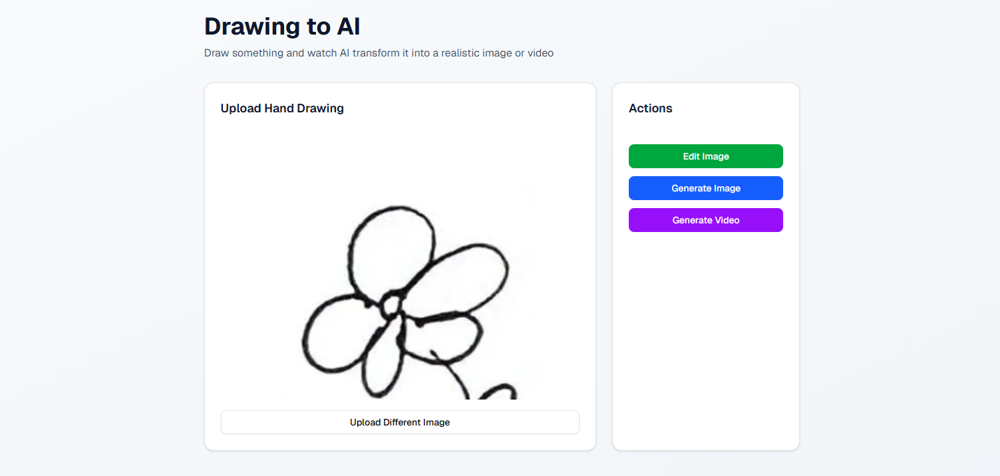
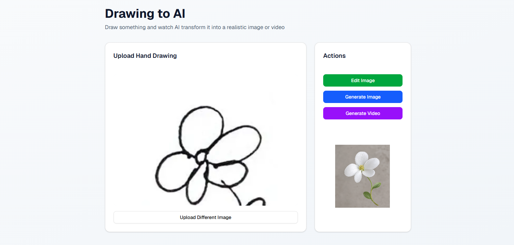

# Drawing to AI

Turn hand drawings into realistic AI-generated images and videos.

## Overview

**Drawing to AI** is a web application that transforms simple hand-drawn sketches into realistic AI-generated visuals. Users can upload drawings, edit them, and generate realistic images or videos directly inside the app.

The project uses **Qubrid AI APIs** for AI-powered generation workflows, leveraging:

- **Qwen Image Edit 2.0** for realistic image generation and editing
- **P-Video** model for AI video generation

The goal of this project is to make AI-powered creativity simple, interactive, and accessible.

---

## Features

- Upload hand-drawn sketches
- Edit uploaded images
- Generate realistic AI images
- Generate AI videos
- Real-time preview interface
- Clean and minimal UI
- Powered by Qubrid AI APIs

---

## AI Models Used

### Qwen Image Edit 2.0
Used for transforming hand-drawn sketches into realistic AI-generated images while preserving the original structure of the drawing.

### P-Video
Used for generating AI-powered videos from uploaded sketches and generated outputs.

### API Provider
This project uses **Qubrid AI API keys** and infrastructure for model inference and generation.

---

## Screenshots

### Before Generation
Upload a hand-drawn sketch into the application.



### After Generation
AI transforms the drawing into a realistic image.



---

## How It Works

1. Upload a drawing or sketch
2. Edit the image if needed
3. Click **Generate Image** or **Generate Video**
4. AI processes the input using Qubrid APIs
5. View the generated result instantly

---

## Tech Stack

- Next.js
- React
- TypeScript
- Tailwind CSS
- Qubrid AI APIs
- Qwen Image Edit 2.0
- P-Video Model

---

## Installation

Clone the repository:

```bash
git clone https://github.com/sharur7/drawing-ai.git
cd drawing-ai
